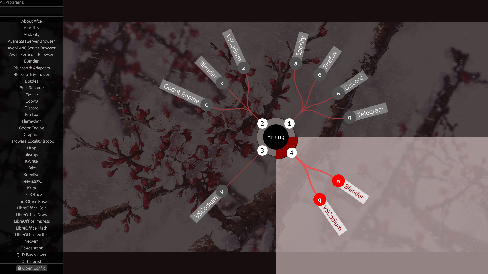

# Hring Launcher

**Hring** is an experimental orbital app launcher for Linux. It uses a radial, donut-style interface to help you organize and launch applications quickly. Designed for tiling window managers and minimal desktop environments.

## Features
- **Orbital UI:** Applications are arranged in a radial "donut" layout for quick, keyboard-driven access.
- **Wallpaper Transparency:** Integrates seamlessly with your desktop background.
- **Async Filtering:** Search results are processed in a background thread to prevent UI freezing.
- **Keyboard-Focused:** Primary navigation is handled via custom keybinds.
- **Rust Powered:** Fast, memory-safe, and low-resource usage.

## Preview


***Wallpaper**: The wallpaper shown in the screenshot is for illustrative purposes only and is not included with the software.*

***Other Images**: Other Bilds you can find [hier](assets/). You can also send **your own setup** and **design-settings file** to me!*

## Installation
### Prerequisites
- [Rust](https://www.rust-lang.org/) (latest stable)
- Linux with X11 or Wayland *(maded and tested with Arch Linux)*

### Build from source
```bash
git clone https://github.com/Xhelgi/hring
cd hring
cargo build --release
# The binary will be available at target/release/hring
```
### Setup Execution

To run `hring` from anywhere, copy the binary to your local bin directory:
```bash
cp target/release/hring ~/.local/bin/
```

**Note:** Ensure that `~/.local/bin` is in your environment's `$PATH`. If it's not, add the following line to your `~/.bashrc` or `~/.zshrc` configuration file:
```bash
export PATH="$HOME/.local/bin:$PATH"
```

## Configuration

Hring looks for its configuration file at ~/.config/hring/config.json.
You can find an example configuration in [examples/config.json](examples/config.json).

Copy it to your config directory:
```Bash
mkdir -p ~/.config/hring
cp examples/config.json ~/.config/hring/config.json
```

## Can be usefull
- [Capacity Guidelines](docs/Capacity.md)
- [Keybinds](docs/Keybinds.md)
- [Design & Customization](docs/Design.md)
- [Feedback & Issues](docs/FeedbackIssues.md)

## Contributing

I welcome any feedback and contributions! Please see [CONTRIBUTING](CONTRIBUTING.md) for details on how to get started.

## Built With
- `Rust` - Base
- `egui` - Immediate mode GUI
- `serde` - JSON configuration

## AI Disclosure
This project was built as a learning exercise. While the core logic and architecture were designed manually, I used an LLM to assist with code refactoring, variable naming, and English documentation.

## License
Distributed under the GPL-3.0 License. See [LICENSE](LICENSE) for more information.