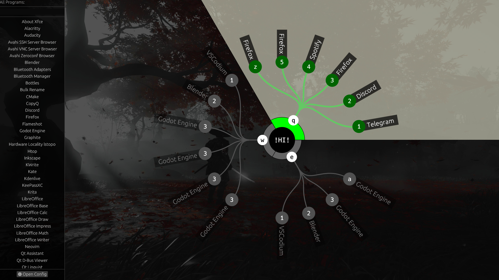
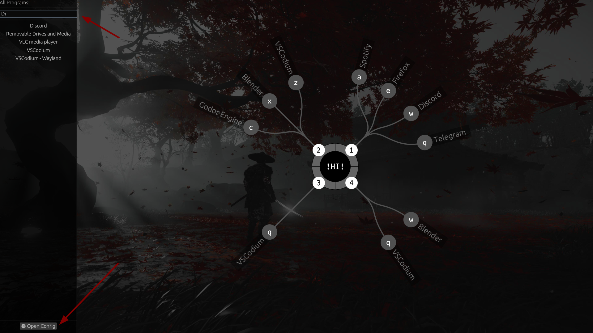

# Hring Launcher

Hring is an experimental orbital app launcher for Linux. It uses a radial, donut-style interface to help you organize and launch applications quickly. Designed for tiling window managers and minimal desktop environments.

## 🚀 Features
- **Orbital UI:** Applications are arranged in a radial "donut" layout for quick, keyboard-driven access.
- **Wallpaper Transparency:** Integrates seamlessly with your desktop background.
- **Async Filtering:** Search results are processed in a background thread to prevent UI freezing.
- **Keyboard-Focused:** Primary navigation is handled via custom keybinds.
- **Rust Powered:** Fast, memory-safe, and low-resource usage.

## 📸 Preview




*Note: The wallpaper shown in the screenshot is for illustrative purposes only and is not included with the software.*

**Since Hring is semi-transparent by default, your desktop wallpaper will blend perfectly with the UI, making every setup unique.**

## 📦 Installation
### Prerequisites
- [Rust](https://www.rust-lang.org/) (latest stable)
- Linux with X11 or Wayland

### Build from source
```bash
git clone https://github.com/Xhelgi/hring
cd hring
cargo build --release
# The binary will be available at target/release/hring
```
### Setup Execution

To run `hring` from anywhere, copy the binary to your local bin directory:
```bash
cp target/release/hring ~/.local/bin/
```

**Note:** Ensure that `~/.local/bin` is in your environment's `$PATH`. If it's not, add the following line to your `~/.bashrc` or `~/.zshrc` configuration file:
```bash
export PATH="$HOME/.local/bin:$PATH"
```

## ⚙️ Configuration

Hring looks for its configuration file at ~/.config/hring/config.json.
You can find an example configuration in [examples/config.json](examples/config.json).

Copy it to your config directory:
```Bash
mkdir -p ~/.config/hring
cp examples/config.json ~/.config/hring/config.json
```

## 🤝 Contributing

I welcome any feedback and contributions! Please see [CONTRIBUTING](CONTRIBUTING.md) for details on how to get started.

## 📐 Capacity Guidelines
Hring is optimized for standard 1920x1080 resolution (1.0x - 1.25x scaling). The recommended limits are:
- **4 groups:** up to 4 applications per group.
- **3 groups:** up to 6 applications per group (recommended).
- **2 groups:** up to 9 applications per group.

*Note: You can adjust the layout by modifying `theme.rs` (font sizes, padding, and offsets) to fit more items.*

## ⌨️ Keybinds
Available keys: `q`, `w`, `e`, `a`, `s`, `d`, `z`, `x`, `c`, `1`, `2`, `3`, `4`, `5`.
Keybinds are scoped: you can use the same key for a group trigger and an application launch without conflict.

**Recommended configurations:**
- **Layout A:** Groups mapped to numbers (1, 2, 3), apps mapped to letters (q, w, e, a, s).
- **Layout B:** Groups mapped to letters (q, w, e), apps mapped to numbers (1, 2, 3, 4, 5).

## 🎨 Design & Customization
All visual parameters (colors, line strokes, padding) are currently defined in `theme.rs`.
*Planned: Move these settings to a persistent JSON configuration file.*
The default theme features a clean, semi-transparent monochrome aesthetic with green accents.

## 💬 Feedback & Issues
If you find a bug or have a suggestion:
1. **Check existing [Issues](https://github.com/Xhelgi/hring/issues):** Someone might already be working on it, or you might find a discussion you can join. 
2. **Contribute:** If you see an open issue that you’d like to fix yourself, feel free to pick it up!
3. **Open a new Issue:** If your bug or idea isn't listed yet, please open a new one. 

Please use the following **labels** for your reports:
- `bug`: Something isn't working.
- `enhancement`: New features or UI improvements.
- `refactor`: Code quality and structural changes.
- `documentation`: Fixes or additions to the README and docs.

## 🛠 Built With
- `Rust`
- `egui` - Immediate mode GUI
- `serde` - JSON configuration

## 📜 License
Distributed under the GPL-3.0 License. See LICENSE for more information.