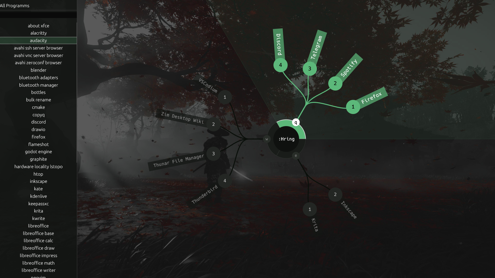
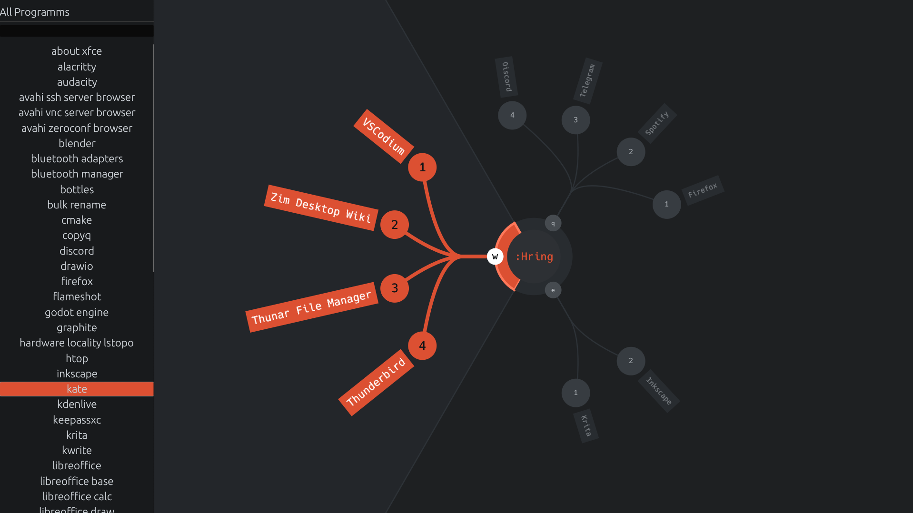

# Welcome to version 0.2.0 of Hring Launcher

**Hring** is a lightweight launcher for Linux systems. It was created with the goal of providing a beautiful, graph-like interface for improved visual perception (I hate lists).

However, the main focus was on **quick keyboard control**.

Controls are divided into groups and applications within them — you can assign any keyboard key to each of them.

# What does it look like?
The app has extensive customization options, including transparency.





## Configuration

The project configuration was divided into three files:
- `graphics.toml` --- contains all graphics settings
- `binds.toml` --- contains settings for groups, applications and hotkeys
- `config.toml` --- contains a list of directories for searching .desktop links.

**You don't need to create them manually.** The Hring Launcher automatically creates configuration files in `~/.config/hring/` when you first launch it. You can edit them afterward. 

If the application doesn't launch after editing the configuration files, the error is most likely due to incorrect formatting. Try deleting them and letting the launcher create new ones.

### Examples

Various graphics configuration templates [are available here.](examples/) 

*You can submit your graphics.toml to the [discussion forum](https://github.com/Xhelgi/hring/discussions) or to xhelgi@proton.me; they may be included in the repository.*

## Installation

### Prerequisites:

- `Rust` (latest stable)
- `Linux` with `X11` or `Wayland`

### Build from source
``` Bash
git clone https://github.com/Xhelgi/hring
cd hring
cargo build --release
# The binary will be available at target/release/hring
```

### Setup Execution
To run `hring` from anywhere, copy the binary to your local bin directory:
``` Bash
cp target/release/hring ~/.local/bin/
```
**Note:** Ensure that `~/.local/bin` is in your environment's `$PATH`. If it's not, add the following line to your `~/.bashrc` or `~/.zshrc` configuration file:
```
export PATH="$HOME/.local/bin:$PATH"
```

### If you are using `i3`

Add **your path** to the executable (you can skip the steps of adding `.local/bin` to `$PATH`) and the desired launch buttons.

1. Open `~/.config/i3/config`
2. Add line `bindsym $mod+d exec --no-startup-id /home/yuki/.local/bin/hring`

## Contributing
I'm always happy if you decide to help develop the Hring. See the [Contributing](CONTRIBUTING.md).

## Feedback & Issueus
[Click Me!](docs/FeedbackIssues.md)

## Build With
- `Rust`
- `eframe`
- `serde`
- `toml`
- `bincode`
- `homedir`
- `freedesktop_entry_parser`

*Thanks to the creators of these crates for the excellent functionality and documentation.*

## License
Distributed under the GPL-3.0 License. See [LICENSE](LICENSE) for more information.